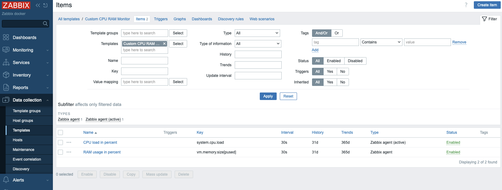
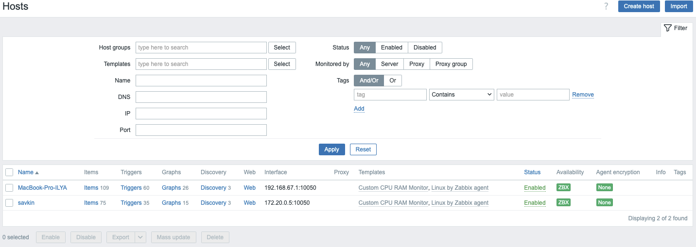

# Домашнее задание к занятию "`Система мониторинга Zabbix. Часть 2`" - `Савкин Илья`

---

### Задание 1

`Создайте свой шаблон, в котором будут элементы данных, мониторящие загрузку CPU и RAM хоста`

`Этапы выполнения`

1. `Создание нового шаблона`
2. `Создание Item для загрузки CPU`
3. `Создание Item для загрузки RAM`

   `Скриншот шаблона с items`
   

---

### Задание 2

`Добавьте в Zabbix два хоста`

### Задание 3

`Привяжите созданный шаблон к двум хостам. Также привяжите к обоим хостам шаблон Linux by Zabbix Agent`

`Этапы выполнения`

1. `Привязка шаблона Custom CPU RAM Monitor`
   

### Задание 4

