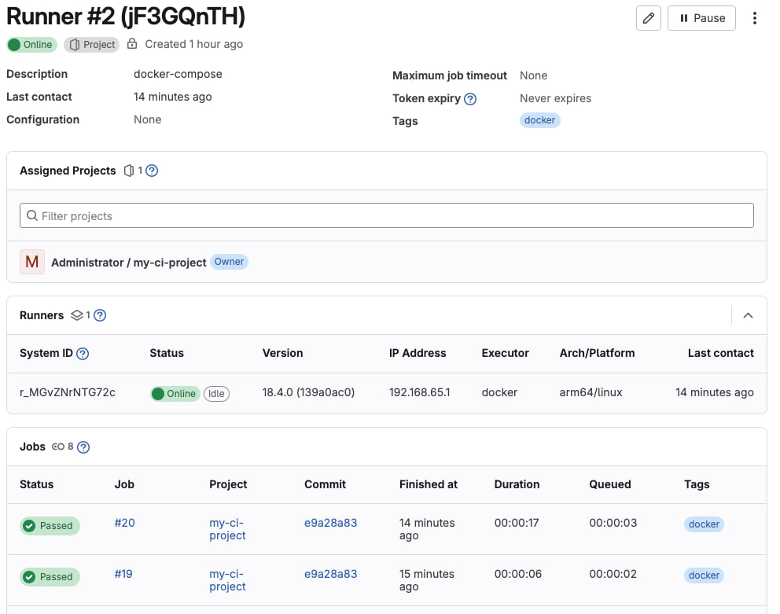
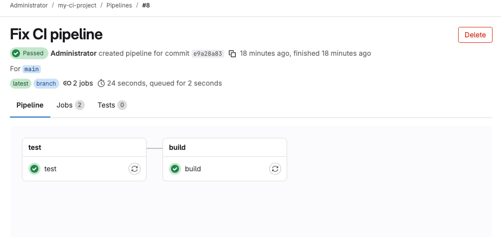
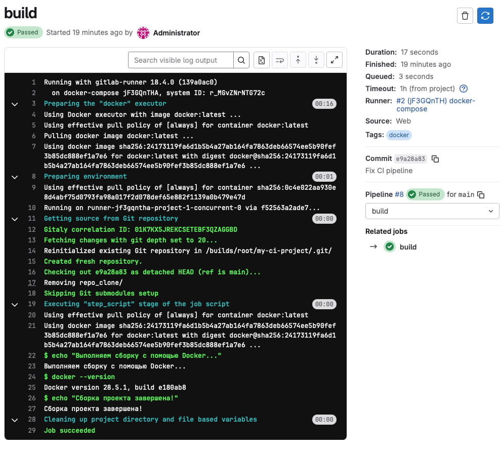
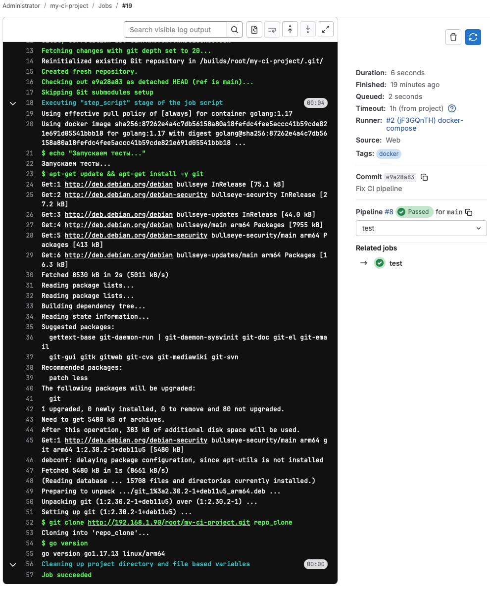

# Домашнее задание к занятию "`GitLab`" - `Савкин Илья`

---

### Задание 1

`Развернул GitLab локально, создал проект и зарегистрировал Docker-runner`

`Этапы выполнения`

1. `Разворачивал GitLab с помощью Vagrantfile`
2. `Создал новый проект и пустой репозиторий в GitLab.`
3. `Зарегистрировал gitlab-runner для проекта.`
4. `Запустил runner в Docker.`



---

### Задание 2

`Настроил CI/CD для проекта.`

`Этапы выполнения`

1. `Запушил репозиторий на GitLab (`git push origin main`).`
2. `Создал `.gitlab-ci.yml` с этапами `build` и `test`. `
3. `Проверил успешное выполнение job’ов и pipeline. `

`Файл `:`
```
# Определяем этапы CI/CD-процесса: сначала тесты, потом сборка
stages:
  - test      # Этап запуска тестов
  - build     # Этап сборки приложения

# Задание для этапа "test5"
test:
  stage: test
  image: golang:1.17          # Используем официальный образ Go 1.17
  tags:
    - docker
  script:
    - echo "Запускаем тесты..."
    - apt-get update && apt-get install -y git   # Устанавливаем git
    - git clone http://192.168.1.90/root/my-ci-project.git repo_clone
    - go version              # Проверяем версию Go (для демонстрации)

# Задание для этапа "build"
build:
  stage: build
  image: docker:latest        # Используем образ Docker для сборки
  tags:
    - docker
  script:
    - echo "Выполняем сборку с помощью Docker..."
    - docker --version        # Проверяем, что Docker доступен
    - echo "Сборка проекта завершена!"
```

`Скриншоты сборки`


 
 


