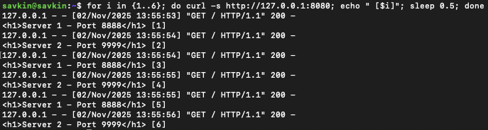
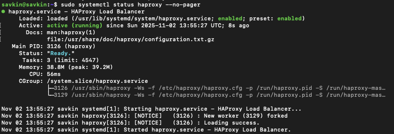
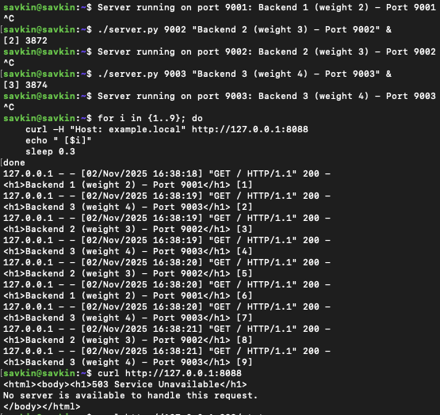

# Домашнее задание к занятию "`Кластеризация и балансировка нагрузки`" - `Савкин Илья`

---

### Задание 1

`Настройте балансировку Round-robin на 4 уровне с помощью HAProxy`

`Этапы выполнения`

1. `Запуск двух простых HTTP-серверов на Python'
   `Порт 8888 → Server 1 - Port 8888`
   `Порт 9999 → Server 2 - Port 9999`
3. `Установка и настройка HAProxy`
   `Установлен пакет haproxy`
   `Настроен TCP-балансировщик на порту 8080 с алгоритмом roundrobin`
4. `Проверка балансировки`

   `Выполнено 6 запросов → чередование серверов 1 → 2 → 1 → 2...`
   
   `Конфигурация haproxy.cfg`
   
```
global
    log /dev/log local0
    log /dev/log local1 notice
    chroot /var/lib/haproxy
    stats socket /run/haproxy/admin.sock mode 660 level admin
    user haproxy
    group haproxy
    daemon

defaults
    log global
    mode tcp
    option tcplog
    timeout connect 5000
    timeout client  50000
    timeout server  50000

listen stats
    bind :888
    mode http
    stats enable
    stats uri /stats
    stats refresh 5s

listen tcp_proxy
    bind :8080
    mode tcp
    balance roundrobin
    server s1 127.0.0.1:8888 check
    server s2 127.0.0.1:9999 check
```




---

### Задание 2

`Этапы выполнения`

1. `Запуск трёх HTTP-серверов`
   `9001 → вес 2`
   `9002 → вес 3`
   `9003 → вес 4`
2. `Настройка /etc/hosts`
   `127.0.0.1 localhost example.local`
3. `Настройка HAProxy (L7)`
   
   ```
global
    log /dev/log local0
    log /dev/log local1 notice
    chroot /var/lib/haproxy
    stats socket /run/haproxy/admin.sock mode 660 level admin
    user haproxy
    group haproxy
    daemon

defaults
    log global
    mode http
    option httplog
    option dontlognull
    timeout connect 5000
    timeout client  50000
    timeout server  50000

listen stats
    bind :888
    mode http
    stats enable
    stats uri /stats
    stats refresh 5s

listen tcp_proxy
    bind :8080
    mode tcp
    balance roundrobin
    server s1 127.0.0.1:8888 check
    server s2 127.0.0.1:9999 check

frontend http_frontend
    bind :8088
    mode http
    acl is_example_local hdr(host) -i example.local
    use_backend weighted_servers if is_example_local
    default_backend no_match

backend weighted_servers
    mode http
    balance roundrobin
    server s1 127.0.0.1:9001 weight 2 check
    server s2 127.0.0.1:9002 weight 3 check
    server s3 127.0.0.1:9003 weight 4 check

backend no_match
    mode http
    errorfile 503 /etc/haproxy/errors/503.http
    ```
    
  
    
---
