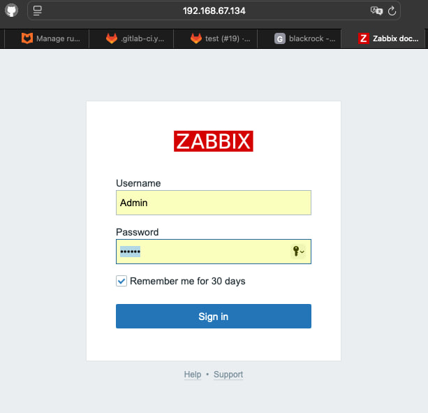
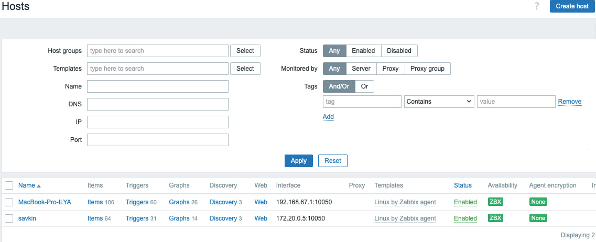
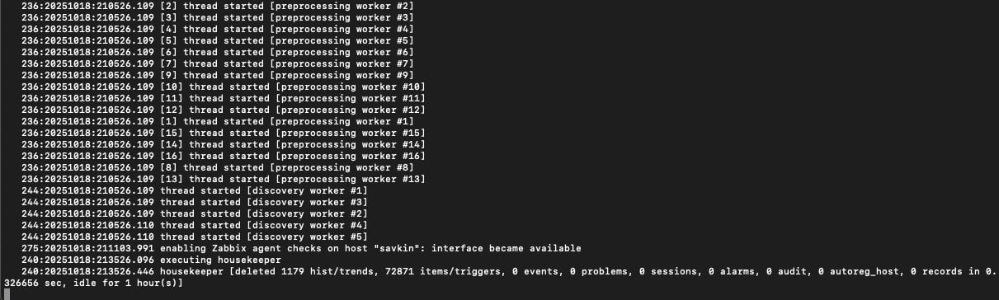
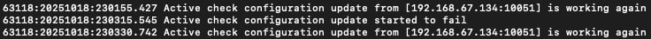
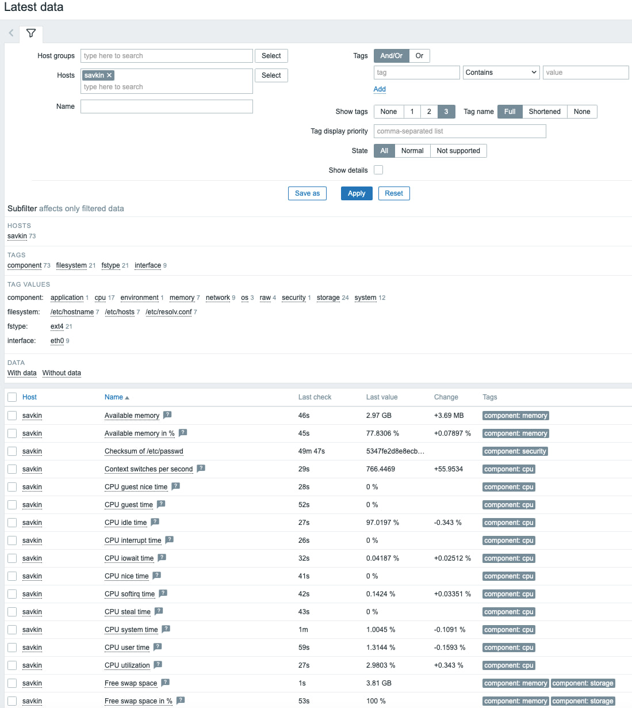
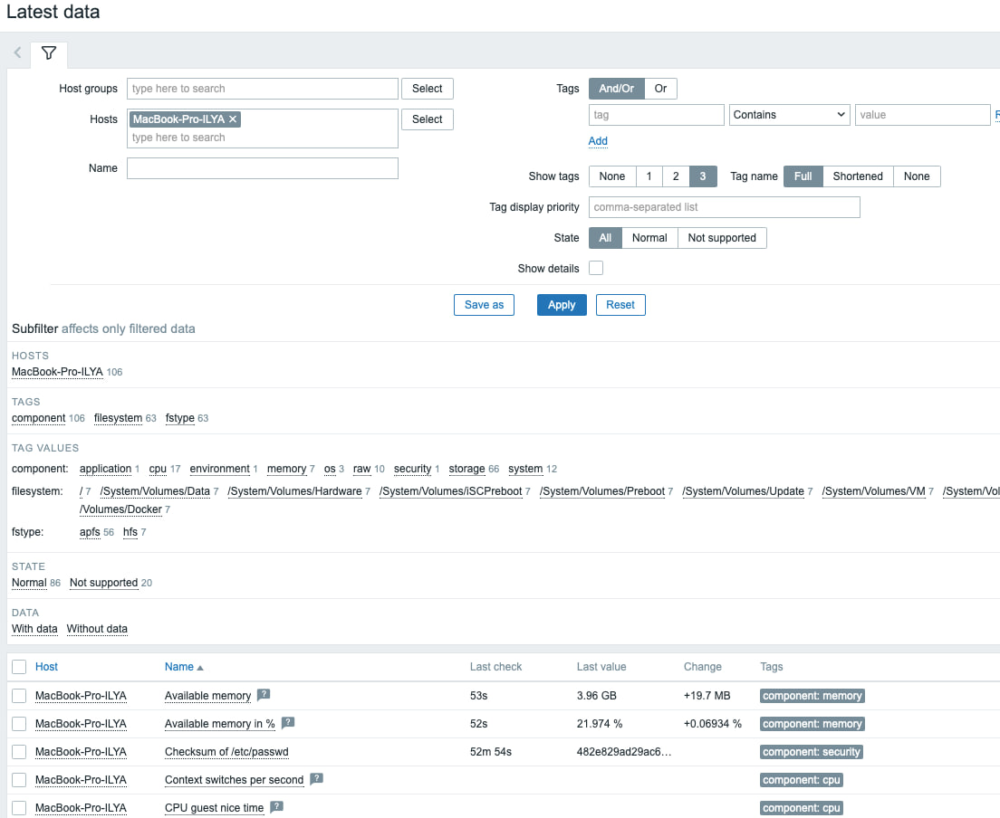

# Домашнее задание к занятию "`Система мониторинга Zabbix`" - `Савкин Илья`

---

### Задание 1

`Установил Zabbix Server с веб-интерфейсом.`

`Этапы выполнения`

1. `Установка Docker и Docker Compose`

```
bash
sudo apt update
sudo apt install -y ca-certificates curl gnupg lsb-release
sudo mkdir -p /etc/apt/keyrings
curl -fsSL https://download.docker.com/linux/ubuntu/gpg | sudo gpg --dearmor -o /etc/apt/keyrings/docker.gpg
echo \
  "deb [arch=$(dpkg --print-architecture) signed-by=/etc/apt/keyrings/docker.gpg] \
  https://download.docker.com/linux/ubuntu $(lsb_release -cs) stable" | \
  sudo tee /etc/apt/sources.list.d/docker.list > /dev/null
sudo apt update
sudo apt install -y docker-ce docker-ce-cli containerd.io docker-compose-plugin
sudo systemctl enable docker
sudo systemctl start docker
```
2. `Создание docker-сети`

```
docker network create zabbix-net
```
3. `Запуск контейнера PostgreSQL`

```
docker run -d \
  --name postgres-zabbix \
  --network zabbix-net \
  -e POSTGRES_USER=zabbix \
  -e POSTGRES_PASSWORD=zabbix \
  -e POSTGRES_DB=zabbix \
  postgres:15
```
4. `Запуск Zabbix Server`

```
docker run -d \
  --name zabbix-server \
  --network zabbix-net \
  -e DB_SERVER_HOST=postgres-zabbix \
  -e POSTGRES_USER=zabbix \
  -e POSTGRES_PASSWORD=zabbix \
  -e POSTGRES_DB=zabbix \
  -p 10051:10051 \
  zabbix/zabbix-server-pgsql:latest
```
5. `Запуск Zabbix Web`
```
docker run -d \
  --name zabbix-web \
  --network zabbix-net \
  -e DB_SERVER_HOST=postgres-zabbix \
  -e POSTGRES_USER=zabbix \
  -e POSTGRES_PASSWORD=zabbix \
  -e ZBX_SERVER_HOST=zabbix-server \
  -p 8080:8080 \
  zabbix/zabbix-web-apache-pgsql:latest
```
6. `Проверка работы`
   ```
   docker ps
   ```
   `Открыть в браузере http://<ip_виртуальной_машины>:8080`

   `Скриншот авторизации под админом`


---

### Задание 2

`Установка Zabbix Agent на два хоста`

`Этапы выполнения`

1. `Установка Zabbix Agent #1 (Docker, на Ubuntu VM)`
2. `Запуск Zabbix Agent в Docker`
```
docker run -d \
  --name zabbix-agent-1 \
  --network zabbix-net \
  -e ZBX_SERVER_HOST=zabbix-server \
  -e ZBX_HOSTNAME="savkin" \
  zabbix/zabbix-agent:latest
```
3. `Установка Zabbix Agent #2 (macOS)`
```
brew install zabbix
sudo mkdir -p /opt/homebrew/etc/zabbix
sudo nano /opt/homebrew/etc/zabbix/zabbix_agentd.conf
      zabbix_agentd.conf
      Server=<IP_Ubuntu_VM>
      ServerActive=<IP_Ubuntu_VM>
      Hostname=MacAgent
      LogFile=/tmp/zabbix_agentd.log
sudo zabbix_agentd -c /opt/homebrew/etc/zabbix/zabbix_agentd.conf
```

`Скриншоты `


 
 








