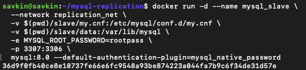
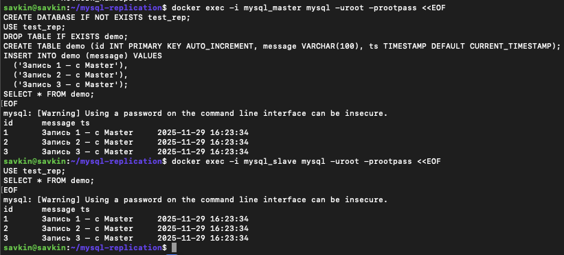

# Домашнее задание к занятию «Репликация и масштабирование. Часть 1» - `Савкин Илья`

---

## Задание 1. Различия режимов (теория)
- **Master-Slave**: запись только на Master, чтение на Master и Slave. Простая, надёжная, без конфликтов.
- **Master-Master**: запись на обоих узлах, данные реплицируются в обе стороны. Высокая доступность, но есть риск конфликтов.

---

## Задание 2. Реализация Master-Slave в Docker

### Конфигурация
- Master: server-id=1, log-bin включён

- Slave:  server-id=2, read-only=1

### Статус репликации
- Master status: mysql-bin.000003, Position 827
- Slave status: Replica_IO_Running=Yes, Replica_SQL_Running=Yes, Seconds_Behind_Source=0

### Тестирование
Создал базу `test_rep` и таблицу `demo` на Master → данные мгновенно появились на Slave.

---
